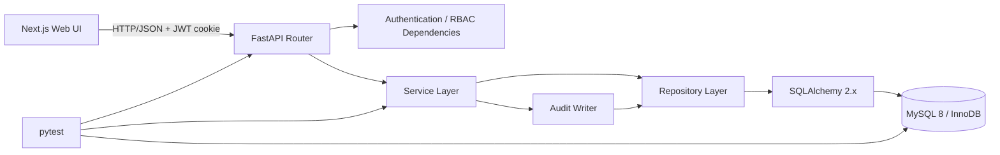
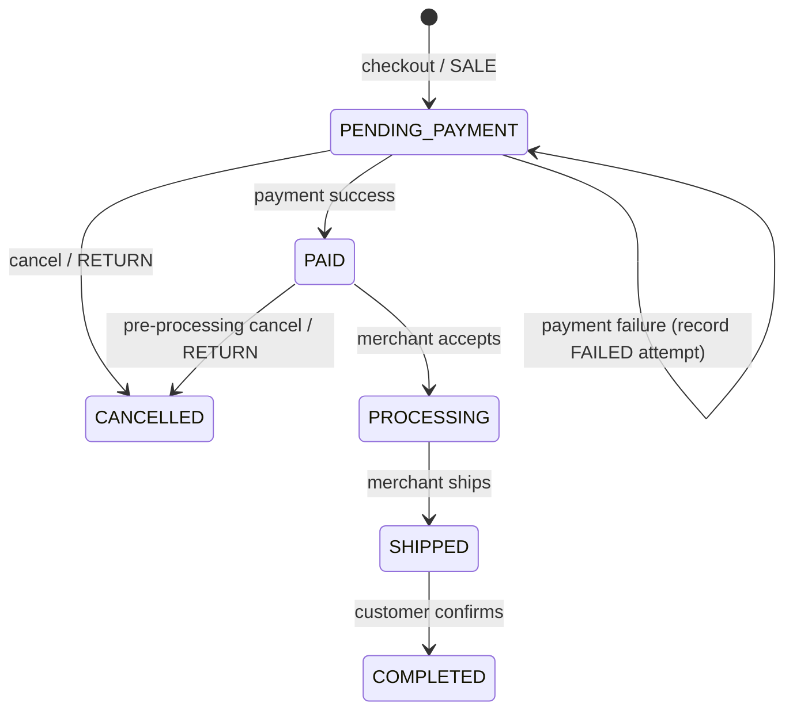

# CommerceHub 架构提案

## 1. 目标与边界

CommerceHub 是单仓库、模块化单体应用。它以简历演示和本地复现为目标，同时保留数据库应用项目最有价值的工程证据：事务边界、行级锁、约束、审计、历史快照和关键流程测试。

项目不采用微服务、消息队列、Redis 或真实第三方支付。部署单元仅包含 MySQL、FastAPI 后端和 Next.js 前端。

## 2. 总体架构



调用规则：

1. Router 只负责 HTTP 协议、依赖注入、鉴权入口和 schema 转换。
2. Service 负责业务规则、资源所有权检查编排和事务边界。
3. Repository 负责 ORM 查询、锁定与持久化，不返回 HTTP 异常。
4. ORM model 不承载跨聚合业务流程。
5. 所有跨表写操作通过 Service 中的单个数据库事务完成。

## 3. 推荐目录

```text
CommerceHub/
├── backend/
│   ├── app/
│   │   ├── api/
│   │   │   ├── deps.py
│   │   │   ├── auth.py
│   │   │   ├── products.py
│   │   │   ├── customer/
│   │   │   ├── merchant/
│   │   │   └── admin/
│   │   ├── core/
│   │   │   ├── config.py
│   │   │   ├── errors.py
│   │   │   ├── logging.py
│   │   │   ├── permissions.py
│   │   │   └── security.py
│   │   ├── db/
│   │   │   ├── base.py
│   │   │   ├── session.py
│   │   │   └── types.py
│   │   ├── models/
│   │   ├── repositories/
│   │   ├── schemas/
│   │   ├── services/
│   │   └── main.py
│   ├── alembic/
│   ├── tests/
│   │   ├── unit/
│   │   ├── integration/
│   │   └── e2e/
│   ├── alembic.ini
│   ├── pyproject.toml
│   └── Dockerfile
├── frontend/
│   ├── app/
│   ├── components/
│   ├── lib/
│   ├── services/
│   ├── types/
│   ├── package.json
│   └── Dockerfile
├── docs/
├── scripts/
│   └── seed_data.py
├── .github/workflows/test.yml
├── .env.example
├── docker-compose.yml
└── README.md
```

## 4. 技术选择

| 领域 | 选择 | 理由 |
|---|---|---|
| 后端 | Python 3.11 + FastAPI | 本机已具备，类型和测试生态成熟 |
| ORM | SQLAlchemy 2.x，同步 Session | 对本项目负载足够，事务和锁代码更直观 |
| 驱动 | PyMySQL | 避免 Windows 本地编译依赖 |
| 配置 | pydantic-settings | 环境变量集中校验 |
| 密码 | Argon2 | 默认安全参数，禁止明文和可逆存储 |
| JWT | 短期 access token | MVP 不实现 refresh token |
| 数据库 | MySQL 8，InnoDB，utf8mb4 | 支持行锁、约束、JSON 和 EXPLAIN |
| 前端 | Next.js App Router + TypeScript + 原生 CSS | 页面复用、角色布局清晰且不增加 UI 依赖 |
| 包管理 | pip/pyproject + npm | 与当前环境一致，不增加工具安装 |
| 测试 | pytest + httpx + 真实 MySQL 测试库 | 验证 MySQL 锁和事务行为 |

生产与 CI 镜像必须固定具体版本，不能使用 `latest`。具体 patch 标签在 Phase 1 创建文件时按可拉取版本锁定。

## 5. 认证和 RBAC

### 5.1 身份状态

- 新注册账户默认 `role=CUSTOMER`、`status=ACTIVE`。
- 用户可创建一条 `merchants(status=PENDING)` 申请；此时仍是 CUSTOMER。
- 管理员批准申请的同一事务中，将 merchant 改为 ACTIVE，并将 user.role 改为 MERCHANT。
- 冻结商家同时限制其商家端写操作，但不改变其历史数据。
- ADMIN 仅由 seed/管理脚本创建，公开注册接口不能创建 ADMIN。

### 5.2 Token 策略

- access token 包含 `sub`、`role`、`iat`、`exp` 和随机 `jti`。
- 后端通过 HttpOnly、SameSite=Lax cookie 传递 JWT；本地环境允许非 Secure，生产必须 Secure。
- Swagger/API 测试同时允许 `Authorization: Bearer`，方便自动化验证。
- JWT 只证明身份；每次请求仍从数据库读取用户状态，冻结立即生效。

### 5.3 授权层次

```text
authenticated
  ├── require_customer
  ├── require_merchant_active
  │     └── assert_store_ownership / assert_product_ownership
  └── require_admin
```

Repository 为写操作提供带 `merchant_id` 的所有权查询，Service 同时区分“资源不存在”和“资源属于其他商家”：不存在返回 404，已存在但越权返回 403，以满足项目验收场景；角色不匹配同样返回 403。响应不得包含其他商家的资源内容。

## 6. 单店订单边界

原需求允许购物车出现多个店铺商品，却只给订单一个全局状态。若一个订单跨多个商家，商家 A 发货会错误改变商家 B 的状态。

MVP 采用以下明确约束：

- 一个 ACTIVE 购物车只能包含同一家店铺的商品；首次加入商品后确定 `carts.store_id`。
- 一个订单只属于一个店铺，`orders.store_id` 为必填外键。
- 用户加入其他店铺商品时返回业务错误，提示先结算或清空当前购物车。
- 商家订单查询和状态更新因此具备清晰所有权与状态语义。

这是有意的简化，不是数据库能力限制。后续若支持跨店结算，应增加 checkout/batch 与 merchant sub-order，而不是复用一个全局订单状态。

## 7. Checkout 事务与防超卖

```mermaid
sequenceDiagram
    participant C as Customer
    participant S as OrderService
    participant DB as MySQL/InnoDB

    C->>S: checkout(address_id, payment_method)
    S->>DB: BEGIN
    S->>DB: Lock ACTIVE cart FOR UPDATE
    S->>DB: Load cart items and active products
    S->>DB: Lock inventory rows FOR UPDATE ordered by product_id
    S->>S: Validate ownership/status/stock; calculate Decimal totals
    S->>DB: Insert order and immutable order_items snapshots
    S->>DB: Decrement inventory and insert SALE transactions
    S->>DB: Insert PENDING payment
    S->>DB: Mark cart CHECKED_OUT
    S->>DB: COMMIT
    S-->>C: order + pending payment
```

实现约束：

- MySQL 隔离级别使用 `READ COMMITTED`，显式 `SELECT ... FOR UPDATE` 负责库存串行化。
- 多商品按 `product_id ASC` 加锁，降低死锁概率。
- 校验库存必须发生在加锁之后。
- `inventory.quantity >= 0` 由数据库 CHECK 约束兜底。
- 订单号和支付号使用不可预测的时间有序标识并设唯一索引；冲突重试不得重复扣库存。
- Service 捕获预期的库存不足并回滚，转换为 HTTP 409；数据库/未知错误记录日志后返回统一 500。
- 测试中的“主动异常”在写入部分订单明细后抛出，验证订单、流水、支付和库存全部回滚。

## 8. 支付、订单与库存状态

订单在 checkout 时已经扣减库存，支付只是状态变化，不再次扣库存。



规则：

- 每次支付尝试单独生成 payment；成功支付前锁定 order 行。
- 若订单已 PAID，重复支付返回原成功结果，不创建第二条成功 payment。
- 模拟支付失败仅记录 FAILED payment，订单仍为 PENDING_PAYMENT，库存继续占用，用户可重试或取消。
- CUSTOMER 可取消 PENDING_PAYMENT；PAID 仅在尚未 PROCESSING 时可取消。
- 取消事务锁定 order 与 inventory，订单变为 CANCELLED、恢复库存并写 RETURN。
- SHIPPED/COMPLETED 不允许直接取消；退款不属于 MVP。

## 9. 错误响应和日志

统一错误格式：

```json
{
  "error": {
    "code": "INSUFFICIENT_STOCK",
    "message": "库存不足",
    "details": {}
  }
}
```

主要映射：校验失败 422、未认证 401、角色不符 403、资源不存在/无所有权 404、状态或库存冲突 409。日志包含 request_id、actor_id、route、status 和耗时，不记录密码、JWT、连接串或 cookie。

## 10. 测试架构

- unit：纯函数、状态转换、金额计算和权限规则。
- integration：Repository、migration、约束、锁和事务；只使用 MySQL 测试库。
- API：真实 FastAPI app + 隔离测试数据，断言响应和数据库终态。
- concurrency：两个独立连接/Session 和线程屏障同时 checkout，不能共享 Session。
- e2e：通过 API 完成商家申请、审批、建店、进货、上架、购买和后台查询。

每个测试创建独立业务数据；涉及并发提交的测试不能依赖外层事务回滚隔离，测试结束后显式清理专用测试库。

## 11. 主要风险与处理

| 风险 | 处理方式 |
|---|---|
| 跨店订单状态含义冲突 | MVP 强制单购物车/订单单店 |
| checkout 扣库后长期不支付 | MVP 支持手动取消恢复；自动超时释放列为扩展 |
| 重复支付或并发支付 | 锁 order；成功状态幂等；唯一业务键 |
| 并发超卖 | InnoDB 行锁、稳定加锁顺序、DB CHECK、真实并发测试 |
| 商家越权 | 角色检查加带 merchant_id 的所有权查询 |
| 金额误差 | Python Decimal + MySQL DECIMAL(12,2)，统一两位小数规则 |
| 历史数据被当前商品覆盖 | order_items 保存名称、SKU、店铺、单价快照 |
| Docker Hub 网络不稳定 | Phase 1 先拉取固定镜像；必要时使用用户可用镜像源 |
| Windows 中文路径 | 容器内使用固定工作目录；脚本全部使用 pathlib/引号 |
| 前端范围膨胀 | 共享表格/表单/状态组件，围绕最终演示脚本实现 |

## 12. Phase 0 结论

需求不存在阻止实现的硬冲突。通过“单店订单”“checkout 即扣库存”“失败支付可重试或取消”“审批后才切换 MERCHANT 角色”四项决策，可以在不引入子订单、库存预占任务和 refresh token 的情况下完成可靠 MVP。
