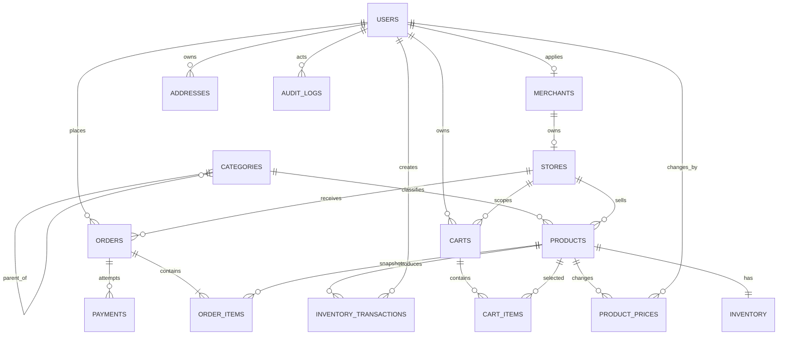
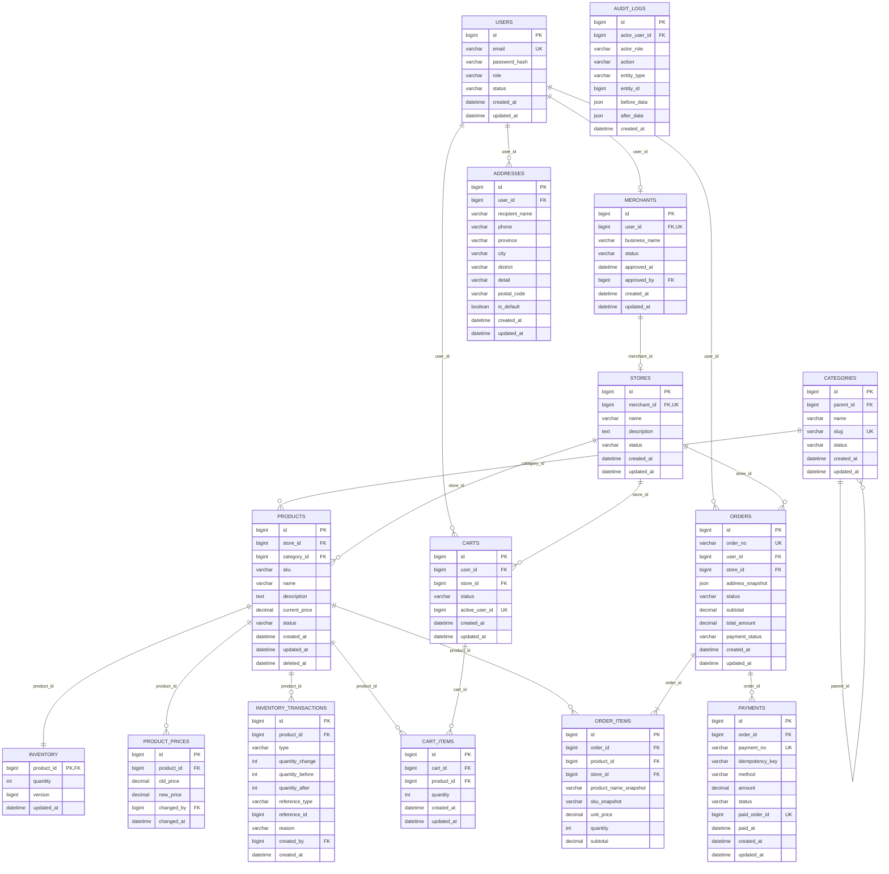

# CommerceHub ERD

## 核心实体关系

## 字段级 ERD

## 删除策略

| 关系 | 策略 | 原因 |
|---|---|---|
| user → merchant/address/cart/order | RESTRICT | 用户不物理删除，保留交易历史 |
| merchant → store | RESTRICT | 商家关闭使用状态字段 |
| store → product/order | RESTRICT | 保留商品及订单历史 |
| category.parent | RESTRICT | 有子分类时禁止物理删除 |
| category → product | RESTRICT | 分类停用代替删除 |
| product → inventory | CASCADE | 仅用于尚无业务数据时的开发清理；生产商品软删除 |
| cart → cart_item | CASCADE | 购物车条目无独立历史价值 |
| order → order_item/payment | RESTRICT | 订单及支付记录永久保留 |
| user → audit_log actor | RESTRICT | 审计主体必须可追溯 |

正常业务不物理删除 user、merchant、store、product、order、payment、inventory transaction 和 audit log。
